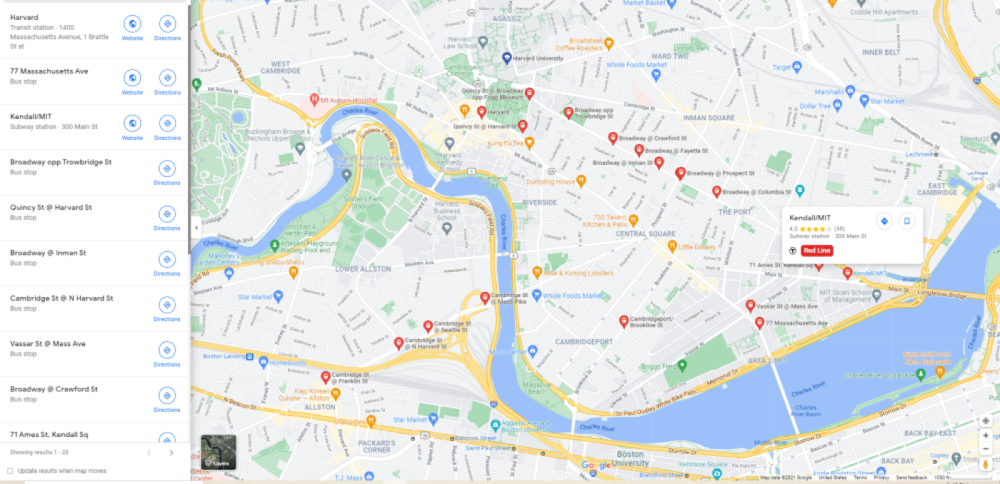

# 
Bus Tracker

### 
About

In this project displays various bus stops between MIT and Harward.

### 
Instructions

 1. Open index.html in a browser
 2. Move the cursor in the window
 3. Watch the pupiles which follow cursor movement

### 
License Information

 - [MIT License](https://mit-license.org/)

